# Operationalizing Machine Learning

In this project, I work with the <a href="https://automlsamplenotebookdata.blob.core.windows.net/automl-sample-notebook-data/bankmarketing_train.csv">Bank Marketing dataset</a>. I will use Azure to configure a cloud-based machine learning production model, deploy it, and consume it. I will also create, publish, and consume a pipeline.

## Architectural Diagram
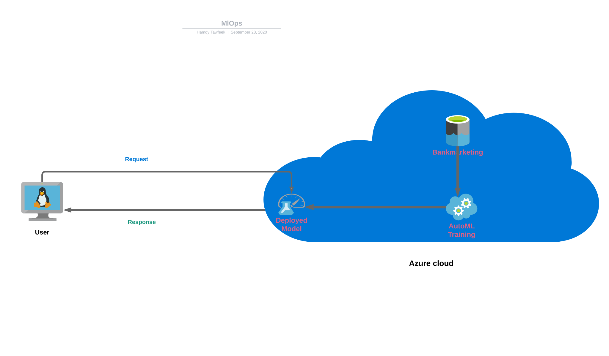

## Project Main Steps

### Step 1: Authentication

In this step, I create a Service Principal account and associate it with your specific workspace.

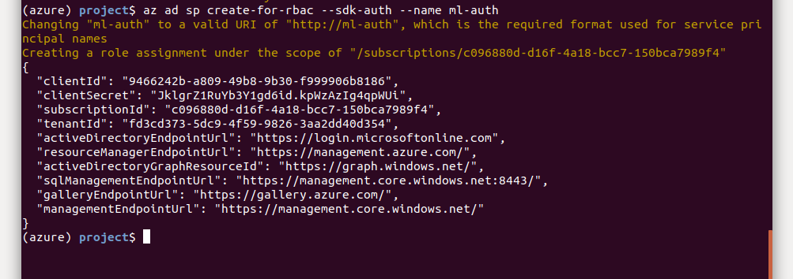
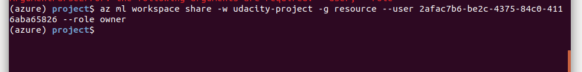

### Step 2: Auto ML Experiment

In this step, I upload the <a href="https://automlsamplenotebookdata.blob.core.windows.net/automl-sample-notebook-data/bankmarketing_train.csv">bankmarketing_train.csv</a> to Azure Machine Learning Studio so that it can be used when training the model. Then, I use AutoMl to generate models.

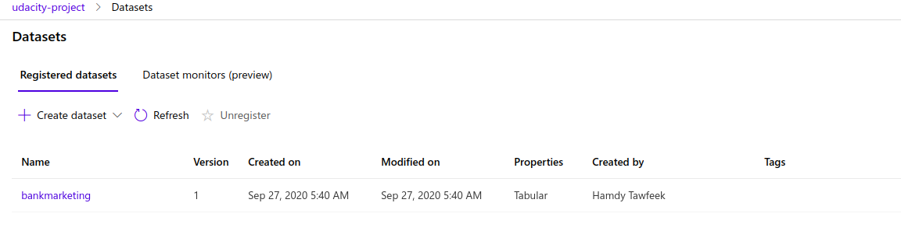
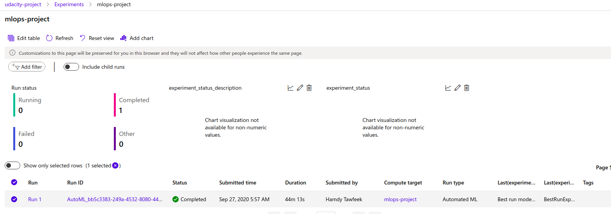
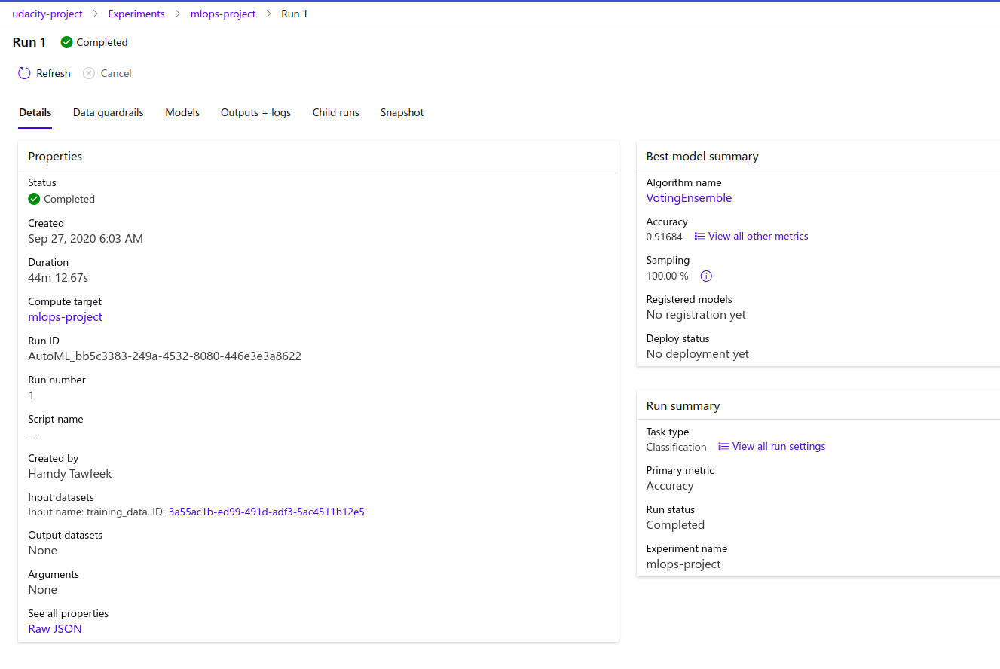

### Step 3: Deploy the Best Model

In this step, I deploy the Best Model that will me allow to interact with the HTTP API service and interact with the model by sending data over POST requests.

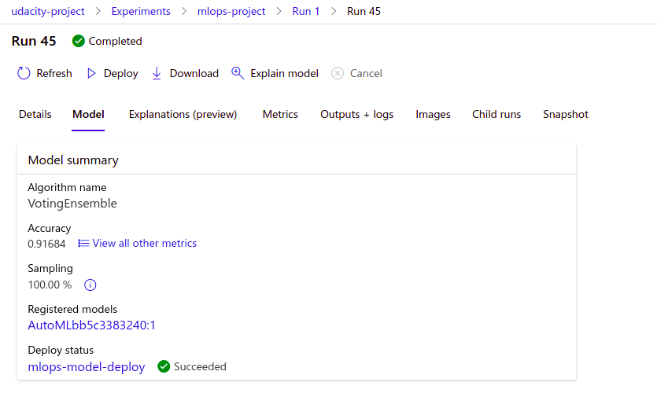
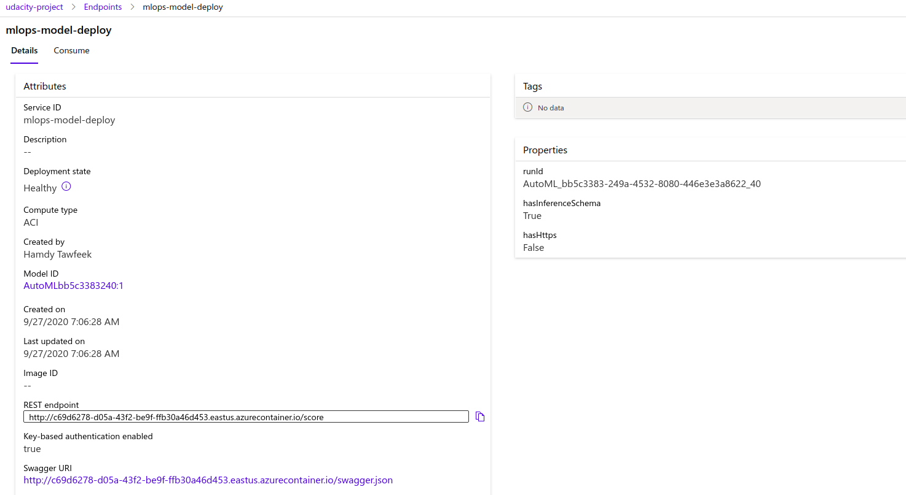

### Step 4: Enable Logging

In this step, I  enable logging so that logs can be retrieved.

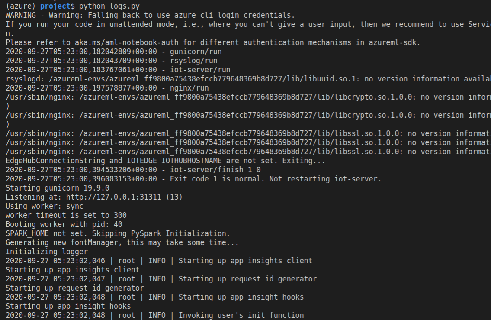
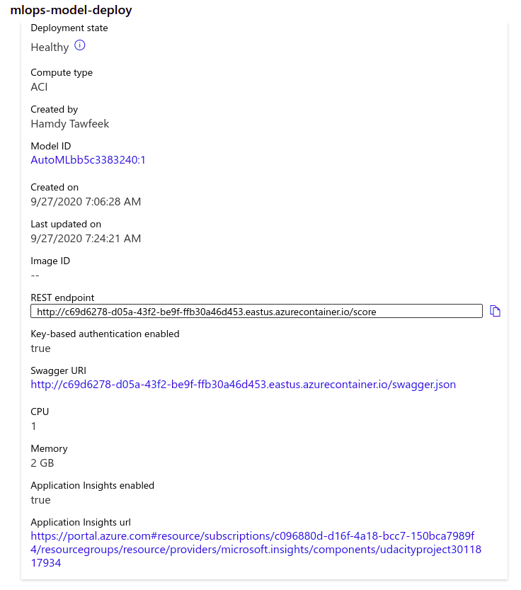
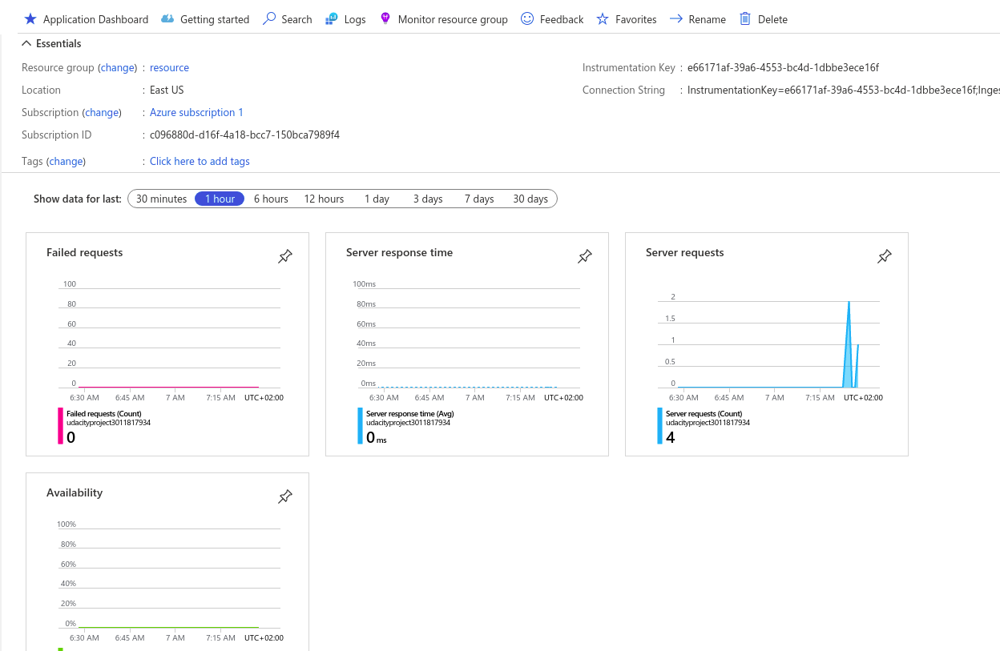

### Step 5: Swagger Documentation

In this step, I consume the deployed model using Swagger.

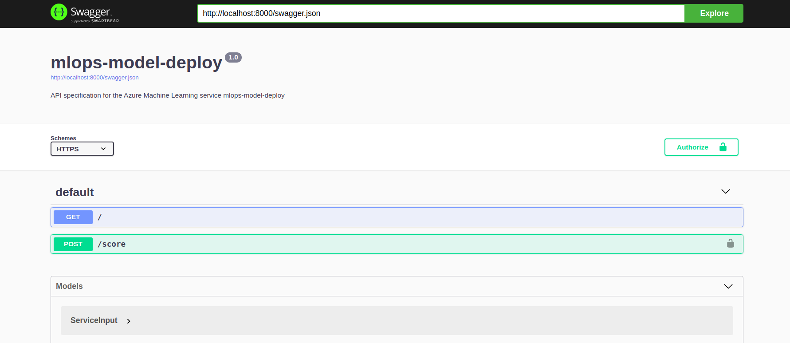
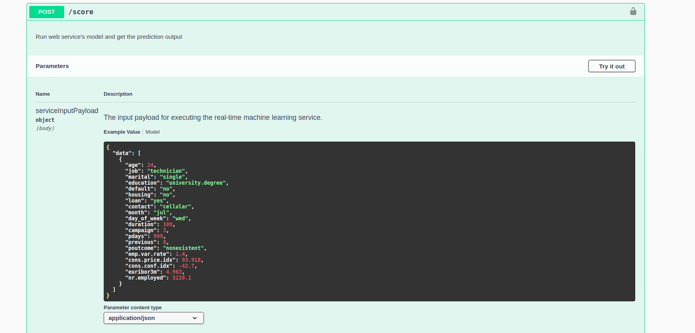

### Step 6: Consume Model Endpoints

In this step, I use the `endpoint.py` script provided to interact with the trained model.

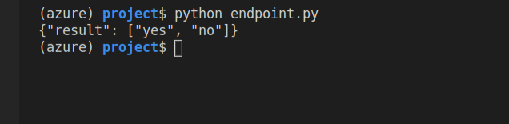
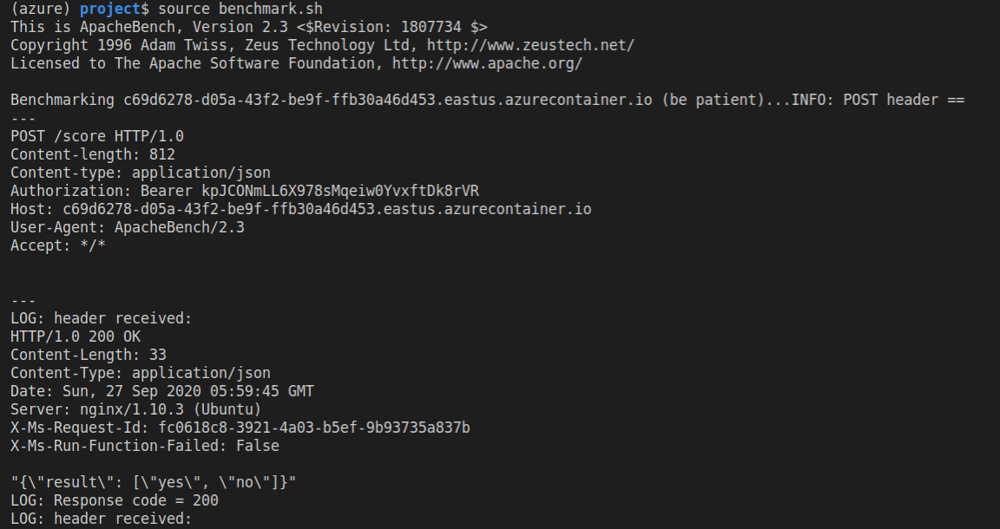
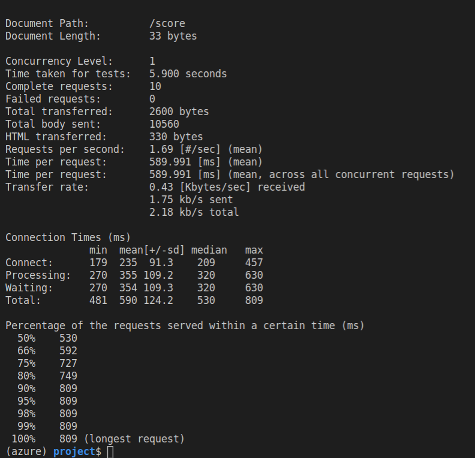

### Step 7: Create and Publish a Pipeline

In this step, I create and publish a pipeline.

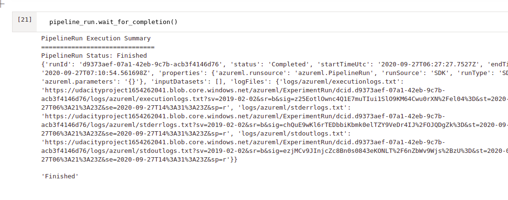
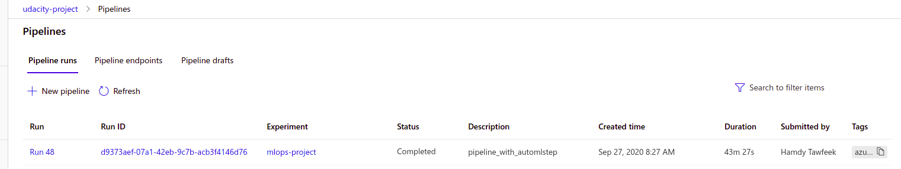
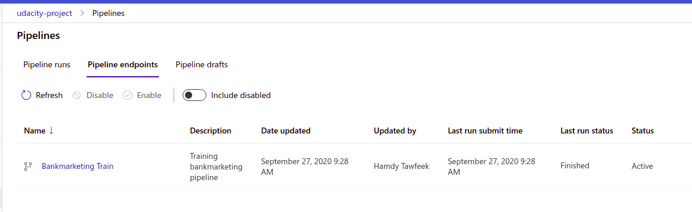
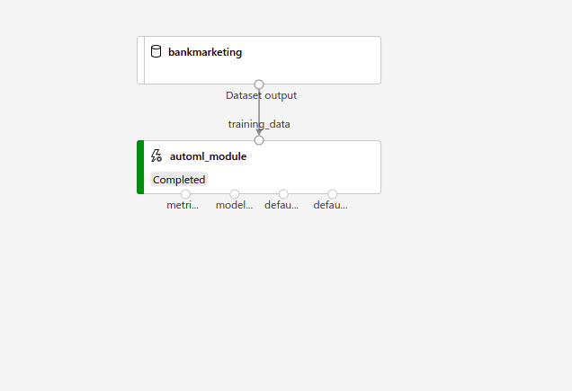
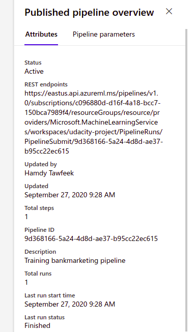
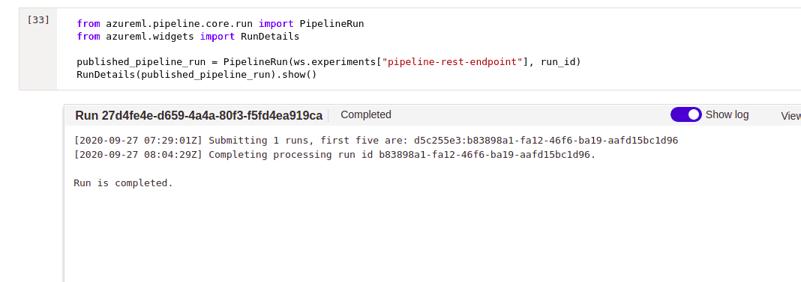
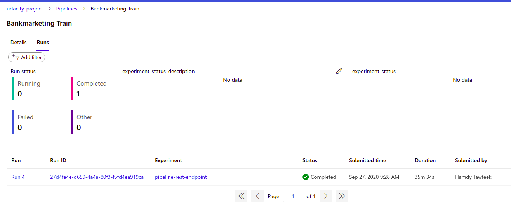

## Screen Recording

Here is a screencast showing the entire process of the working ML application.

<a href="https://youtu.be/xAmBY_D7PpY"> Operationalizing Machine Learning screencast</a>

## Future Enhancement
A great future enhancement for me is to connect gitlab with the azure mazchine learning pipeline I have created.